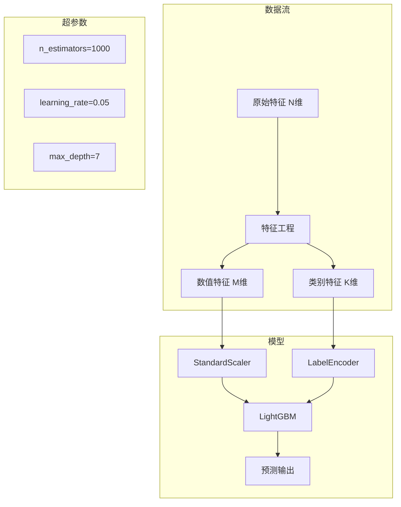
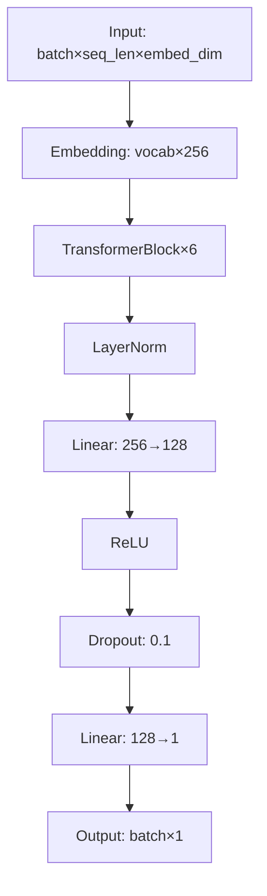

# 实验路径拆解

基于赛题解析，规划实验路径: **$ARGUMENTS**

## Constants

- **MAX_PATHS = 4** — 最多规划的并行实验路径数
- **DETAIL_LEVEL = full** — 架构细节级别: `brief`(概述), `full`(含层维度和参数量)
- **VISUALIZE = true** — 是否生成 Mermaid 架构图

## Inputs

读取以下文件获取上下文:
1. `competition/COMPETITION_ANALYSIS.md` — 赛题解析
2. `CLAUDE.md` — 比赛配置 (metric, target, data info)
3. `data/raw/` — 数据文件 (了解特征数量和类型)

如果 `COMPETITION_ANALYSIS.md` 不存在，先调用 `/competition-analyze`。

## Workflow

### Step 1: 确定问题类型和方案空间

根据赛题分析，确定:
- **任务类型**: 分类 / 回归 / 排序 / 时序 / NLP / CV / 多模态
- **数据规模**: 小 (<10K) / 中 (10K-1M) / 大 (>1M)
- **特征类型**: 表格 / 文本 / 图像 / 混合
- **评价指标特性**: 对什么敏感 (阈值? 排序? 绝对值?)

### Step 2: 设计实验路径树

设计从简单到复杂的实验路径，每条路径是一个递进的改进方向:

```
Baseline (最简单能跑通的方案)
├── Path A: 特征工程方向
│   ├── A1: [具体特征方法]
│   ├── A2: [具体特征方法]
│   └── A3: [具体特征方法]
├── Path B: 模型升级方向
│   ├── B1: [具体模型]
│   ├── B2: [具体模型]
│   └── B3: [具体模型]
├── Path C: 训练策略方向
│   ├── C1: [具体策略]
│   └── C2: [具体策略]
└── Path D: 集成与后处理
    ├── D1: [集成方法]
    └── D2: [后处理方法]
```

### Step 3: 详细拆解每个节点

对每个实验节点，输出:

1. **方法描述** — 做什么，为什么预期有效
2. **模型架构** — 详细到层级:
   - 输入维度
   - 每层类型、参数、激活函数
   - 输出维度
   - 参数量估算
   - 训练时间估算
3. **特征工程** — 具体的特征构造方法
4. **训练配置** — optimizer, lr, scheduler, batch_size, epochs
5. **预期收益** — 预计能提升多少 (基于类似比赛经验)
6. **风险评估** — 可能失败的原因
7. **优先级** — MUST-RUN / SHOULD-TRY / NICE-TO-HAVE
8. **依赖关系** — 是否依赖其他实验的结果

### Step 4: 生成模型架构可视化

对每个主要模型方案，生成 Mermaid 图:

**调用 `/competition-visualize` 或直接生成 Mermaid:**



对于深度学习模型，展示更详细的层结构:


### Step 5: 输出实验路径文档

生成 `competition/EXPERIMENT_PATH.md`:

```markdown
# 实验路径拆解

## 总览

| 路径 | 方向 | 预期收益 | 优先级 | 预计耗时 |
|------|------|----------|--------|----------|
| Baseline | 快速跑通 | - | MUST | 30min |
| A1 | 统计特征 | +2-5% | MUST | 1h |
| B1 | XGBoost | +1-3% | SHOULD | 1h |
| ... | ... | ... | ... | ... |

## 实验执行顺序
[按优先级和依赖关系排列的执行顺序]

## Baseline: [方案名]
### 模型架构
[Mermaid 图 或 文字描述]
### 特征
[特征列表]
### 训练配置
[超参数]
### 预期结果
[预计分数范围]

## Path A: 特征工程
### A1: [具体方法]
[详细拆解...]

[... 每个节点都有完整拆解 ...]
```

### Step 6: 生成可视化文件

将所有 Mermaid 图保存到 `figures/`:
- `figures/experiment-tree.mmd` — 实验路径树
- `figures/model-baseline.mmd` — 基线模型架构
- `figures/model-advanced.mmd` — 进阶模型架构
- `figures/feature-pipeline.mmd` — 特征工程流水线

### Step 7: 初始化实验追踪

创建 `competition/SCORE_HISTORY.json`:
```json
{
  "competition": "<name>",
  "metric": "<metric>",
  "direction": "<minimize/maximize>",
  "experiments": [],
  "best_local": null,
  "best_online": null
}
```

创建 `competition/EXPERIMENT_LOG.md`:
```markdown
# 实验记录

> 自动追踪每次实验的方法、结果和发现。

---
```

### 输出

向用户展示:
1. 实验路径树概览
2. 推荐的执行顺序
3. 第一个要实现的实验 (通常是 Baseline)
4. 提示用户可以用 `/competition-iterate` 开始自动迭代
