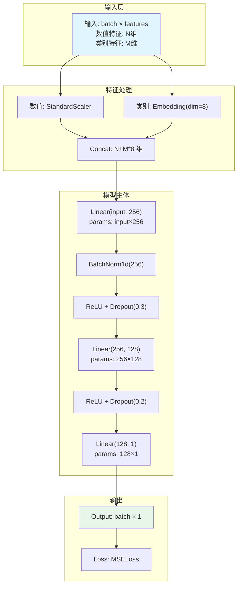
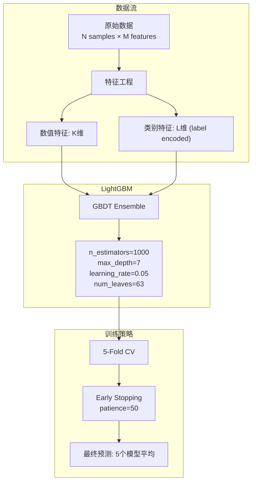
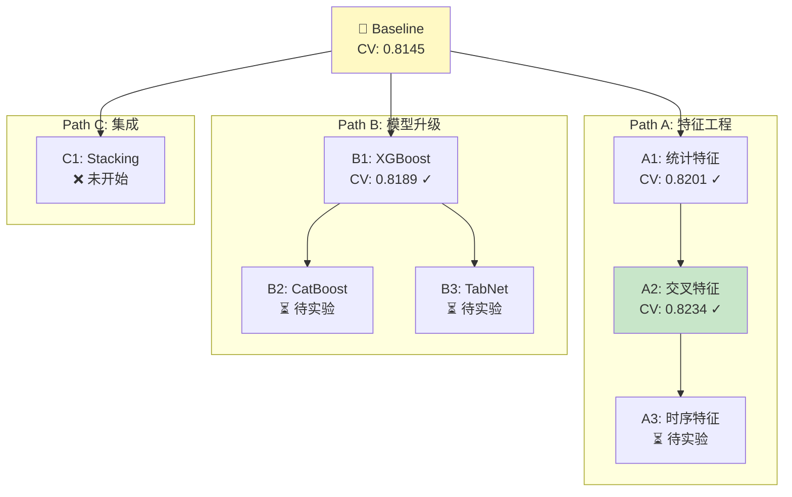
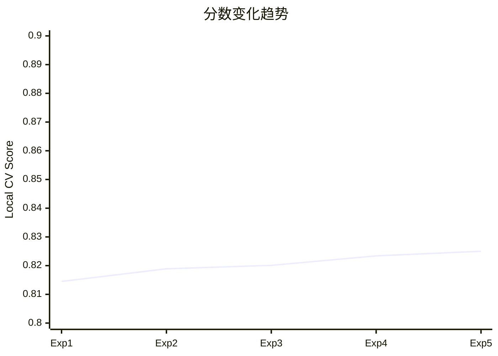
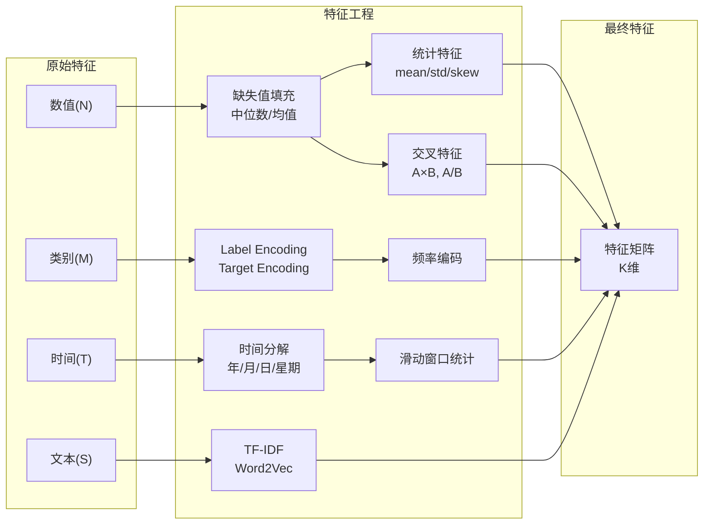

# 竞赛可视化

生成可视化: **$ARGUMENTS**

## Constants

- **FORMAT = mermaid** — 输出格式: `mermaid` (默认), `ascii`, `python` (matplotlib)
- **DETAIL = full** — 细节级别: `brief`(概览), `full`(含维度和参数)

## Workflow

### 判断可视化类型

根据 $ARGUMENTS 或上下文判断需要生成什么:

1. **model** / **架构图** → 生成模型架构图
2. **tree** / **实验树** → 生成实验路径树
3. **score** / **分数** → 生成分数变化图
4. **feature** / **特征** → 生成特征工程流水线图
5. **all** / 无参数 → 生成所有

---

### Type 1: 模型架构图

读取 `src/models/` 下的模型代码，提取:
- 输入维度和类型
- 每一层的类型、参数、输出维度
- 激活函数
- 正则化 (dropout, batch norm)
- 损失函数
- 总参数量

生成 Mermaid 图到 `figures/model-architecture.mmd`:



对于树模型 (LightGBM/XGBoost):


### Type 2: 实验路径树

读取 `competition/EXPERIMENT_PATH.md` 和 `competition/SCORE_HISTORY.json`。

生成 `figures/experiment-tree.mmd`:



标记规则:
- ✓ 绿色: 已完成且有正向结果
- ❌ 红色: 已完成但效果不好
- ⏳ 黄色: 待实验
- 🏆 金色: 当前最佳

### Type 3: 分数变化图

读取 `competition/SCORE_HISTORY.json`。

生成 `figures/score-progression.mmd`:



同时生成文本版本 (兼容不支持 Mermaid 的环境):
```
分数变化:
Exp-001 ████████░░ 0.8145 (baseline)
Exp-002 ████████░░ 0.8189 (+0.0044)
Exp-003 █████████░ 0.8201 (+0.0012)
Exp-004 █████████░ 0.8234 (+0.0033) ← best
Exp-005 █████████░ 0.8250 (+0.0016) ← new best 🏆
```

### Type 4: 特征工程流水线图

读取 `src/features/` 下的代码。

生成 `figures/feature-pipeline.mmd`:



### 输出

所有可视化文件保存到 `figures/` 目录:
- `figures/model-architecture.mmd`
- `figures/experiment-tree.mmd`
- `figures/score-progression.mmd`
- `figures/feature-pipeline.mmd`

同时在 `competition/EXPERIMENT_PATH.md` 中内联引用这些图。

向用户展示生成的可视化内容 (直接在终端中渲染 Mermaid 代码块)。
